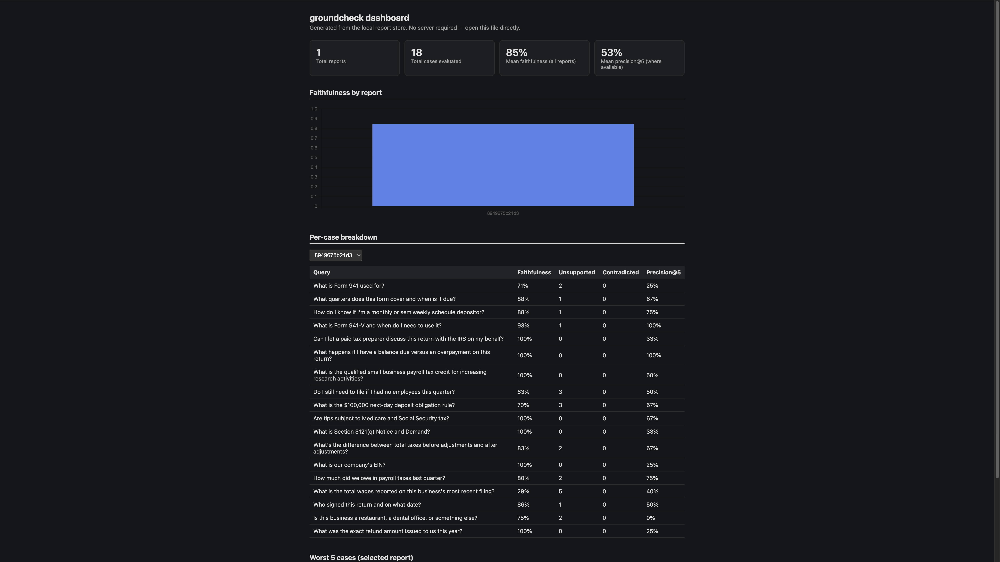
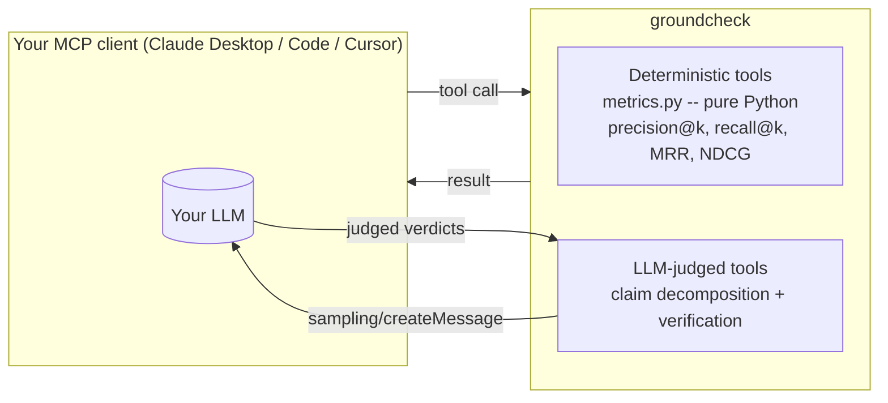

<!-- mcp-name: io.github.offquestxo/groundcheck -->
# groundcheck

**Playwright verifies your UI. Sentry verifies your runtime. groundcheck verifies your AI's answers.**

An MCP server that lets any AI agent evaluate RAG outputs -- faithfulness
scoring, hallucination detection, and retrieval quality metrics -- with zero
API keys, using MCP sampling so the judge model is whatever the connected
client is already running.

## The problem

You've vibe-coded a RAG app. It answers, but sometimes it makes stuff up, and
you can't tell when. There's no test for "did the model lie about what the
documents say." groundcheck is that test.

## Demo


<!-- TODO: record a short terminal/Claude Desktop demo GIF showing
     groundcheck_detect_hallucinations catching a planted hallucination,
     and drop it at docs/demo.gif. Placeholder above until then. -->

### Eval dashboard



`groundcheck-dashboard --out docs/dashboard.html` generates a single
self-contained HTML file from your report store -- summary cards, a
faithfulness-by-report chart, a sortable per-case table, and worst-5-cases,
all with Chart.js loaded from a CDN and the data embedded inline. Opens
straight from disk, no server required.

[docs/dashboard.html](docs/dashboard.html) in this repo is generated from a
real report: knowledge-assistant's 18-query eval (see its Evaluation
section, cross-linked above) -- not synthetic smoke-test numbers. Enable
GitHub Pages on this repo to get a live, clickable link instead of a
clone-and-open file (see Roadmap).

## Quickstart

**Claude Code:**

```bash
claude mcp add groundcheck -- uvx groundcheck
```

**Claude Desktop** -- add to `claude_desktop_config.json`
([full example](examples/claude_desktop.json)):

```json
{ "mcpServers": { "groundcheck": { "command": "uvx", "args": ["groundcheck"] } } }
```

**Cursor** -- same shape, in `.cursor/mcp.json` (see
[examples/claude_code.md](examples/claude_code.md) for the full config).

No API key needed if your client supports MCP sampling. Try it: ask your
agent to run `groundcheck_detect_hallucinations` on an answer and its
sources.

## Tools

| Tool | What it does | Judge? |
|---|---|---|
| `groundcheck_evaluate_faithfulness` | Claim-by-claim faithfulness score (0-1) against sources | LLM (sampling) |
| `groundcheck_detect_hallucinations` | Only the unsupported/contradicted claims, for a fix-it loop | LLM (sampling) |
| `groundcheck_evaluate_retrieval` | precision@k, recall@k, MRR, NDCG -- gold labels (instant) or LLM-graded | Optional |
| `groundcheck_compare` | Judge which of two candidate answers is better, with position-bias mitigation | LLM (sampling) |
| `groundcheck_run_suite` | Batch-evaluate a set of cases (inline or JSONL), persist a report | LLM (sampling) |
| `groundcheck_get_report` | Fetch a persisted report by id | None |

## How it works



The split matters: retrieval metrics with gold labels are pure math and run
instantly with zero model calls. Faithfulness, hallucination detection, and
compare need semantic judgment, so they call back into **your own connected
model** via [MCP sampling](https://modelcontextprotocol.io/docs/learn/server-concepts#sampling)
-- no separate API key, no separate bill. If your client doesn't support
sampling yet, set `ANTHROPIC_API_KEY` as a fallback; if neither is available,
you get a clear error naming both options.

**Cost**: deterministic metrics are free (no model calls). LLM-judged tools
cost 1-2 model calls via your client's existing inference -- no API key
required on top of what you're already paying your client for.

## What groundcheck is NOT

- **Not an observability platform.** It doesn't collect traces, dashboards,
  or alerts over time -- it scores the RAG output you hand it, once, when
  you ask. For production observability, look at
  [LangSmith](https://www.langchain.com/langsmith) or
  [Arize Phoenix](https://phoenix.arize.com/).
- **Not for agent-trajectory evals.** It judges answers against sources, not
  whether an agent took the right sequence of actions.
- **Not enterprise-scale.** Reports are local JSON files. If you need
  multi-tenant dashboards, RBAC, or dataset versioning at scale, LangSmith or
  Phoenix are the right tool.

## Case studies

- [evals/RESULTS.md](evals/RESULTS.md) tracks tool-selection and
  hallucination-detection accuracy before and after tuning tool docstrings --
  the actual before/after numbers, not just the final descriptions.
- **Real RAG app**: [knowledge-assistant](https://github.com/offquestxo/knowledge-assistant)
  (a multi-tenant document Q&A app) uses groundcheck to score its own
  real pipeline output -- 18 real queries against a real document, 85% mean
  faithfulness, 94% mean NDCG@5. The interesting finding wasn't a perfect
  score: the app never hallucinated a fact, but groundcheck's strict
  literal-support judge flagged several accurate paraphrases as
  "unsupported" -- a useful data point about judge strictness, not just
  app quality. Full breakdown in its
  [README Evaluation section](https://github.com/offquestxo/knowledge-assistant#evaluation).

## Security

Read-only, compute-only server: no shell access, no network egress except an
opt-in `ANTHROPIC_API_KEY` fallback, no filesystem writes outside the local
report store. `dataset_path` is validated against an allowlisted directory
to prevent path traversal. Full threat model in [SECURITY.md](SECURITY.md).

## Roadmap

- [ ] MCP Tasks primitive for async `run_suite` on large datasets.
- [ ] MCP Apps report UI (render a report inline instead of raw JSON).
- [ ] Publish to PyPI and the MCP Registry (packaging is ready; not yet published).
- [ ] Live FastAPI dashboard (v2) -- `groundcheck-dashboard`'s static HTML file is
  the v1 by design (zero deployment burden); a running app with live updates
  is a reasonable next step once there's a reason to keep one up.
- [ ] Enable GitHub Pages for `docs/dashboard.html` so there's a live, clickable
  "see eval results" link with no clone required.

## Development

```bash
uv sync --all-extras
uv run pytest
uv run ruff check .
```

MIT licensed. See [LICENSE](LICENSE).
